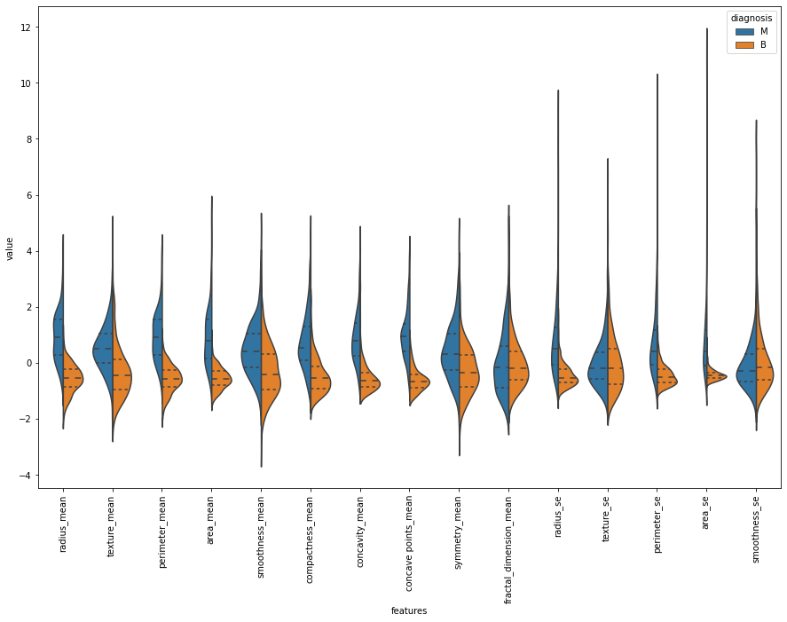
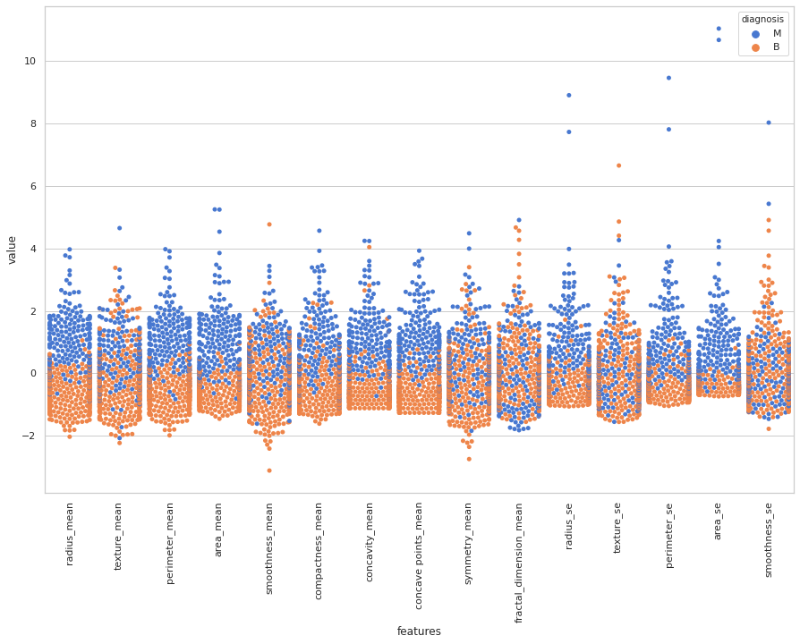

# Breast Cancer Classification
Classifying breast cancer diagnosis using various prediction models

## PROJECT DESCRIPTION
Using data from a digitized images of a brest mass in the state of Wisconsin, this notebook will use feature selection and model building using several different algorithms to attempt to predict whether a breast mass is benign or malignant.

## ABOUT THE DATA 

#### SOURCE: 
The data used in this note book comes from Kaggle (https://www.kaggle.com/uciml/breast-cancer-wisconsin-data?select=data.csv)
provided by UCI Machine Learning

## METHODOLOGY

This notebook consists of an exploratory data analysis of the variables presented in the dataset followed by feature selection and predictive model building and evaluation. 
The EDA section makes use of visualization techniques to get an overview of the data and the correlation between each feature and the target variable.
Using violin and swarm plots we'll be able to see what kind of distinctions there are between benign and malignant cases and their respective feature variables.

VIOLIN PLOT: 
 

SWARM PLOT:

## OUTSTANDING OBSERVATIONS

* Radius, Area, and Perimeter are the variables most correlated with the target variable (benign or malignant)

## MODEL BUILDING

MODELS USED: 
* RANDOM FOREST
* RANDOM FOREST USING SELECT K BEST FEATURES
* SUPPORT VECTOR MACHINE
* LOGISTIC REGRESSION
* DECISION TREE
* K NEAREST NEIGHBOR

## MODEL EVALUATION: 
Several metrics were used to evaluate our models including:
* ACCURACY SCORE
* F1 SCORE
* LOG LOSS
* CONFUSION MATRIX

## CONCLUSION

It appears that the Random Forest algorithm gives us the best chance at accuracy within our dataset with an accuracy score of 93% and Log Loss of 16%.

Thanks for stopping by!

Milton
